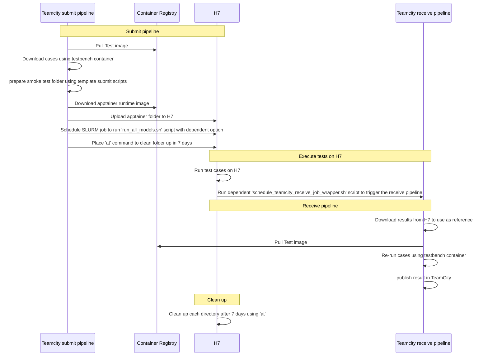

# Container Smoke Test Sequence Diagram

```mermaid
sequenceDiagram
    participant TC_SUBMIT as Teamcity submit pipeline
    participant Registry as Container Registry
    participant H7 as H7
    participant TC_Receive as Teamcity receive pipeline

    Note over TC_SUBMIT,H7: Submit pipeline
    %% Setup Phase
    TC_SUBMIT->>Registry: Pull Test image
    TC_SUBMIT->>TC_SUBMIT: Download cases using testbench container
    TC_SUBMIT->>TC_SUBMIT: prepare smoke test folder using template submit scripts
    TC_SUBMIT->>Registry: Download apptainer runtime image
    TC_SUBMIT->>H7: Upload apptainer folder to H7
    TC_SUBMIT->>H7: Schedule SLURM job to run 'run_all_models.sh' script with dependent option
    TC_SUBMIT->>H7: Place 'at' command to clean folder up in 7 days
    

    Note over H7,TC_Receive: Execute tests on H7
    %% Cleanup Phase
    H7->>H7: Run test cases on H7
    H7->>TC_Receive: Run dependent 'schedule_teamcity_receive_job_wrapper.sh' script to trigger the receive pipeline
    
    
    Note over H7,TC_Receive: Receive pipeline
    TC_Receive->>TC_Receive: Download results from H7 to use as reference
    TC_Receive->>Registry: Pull Test image
    TC_Receive->>TC_Receive: Re-run cases using testbench container
    TC_Receive->>TC_Receive: publish result in TeamCity
    
    
    %% Final clean up
    Note over H7,H7: Clean up
    H7->>H7: Clean up cach directory after 7 days using 'at'
    
```

